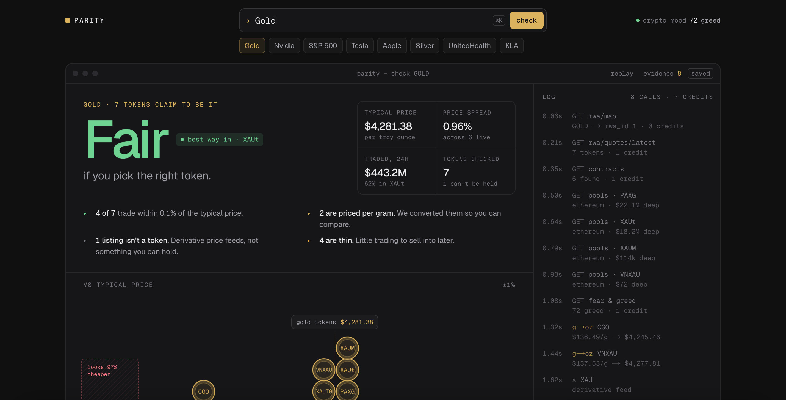
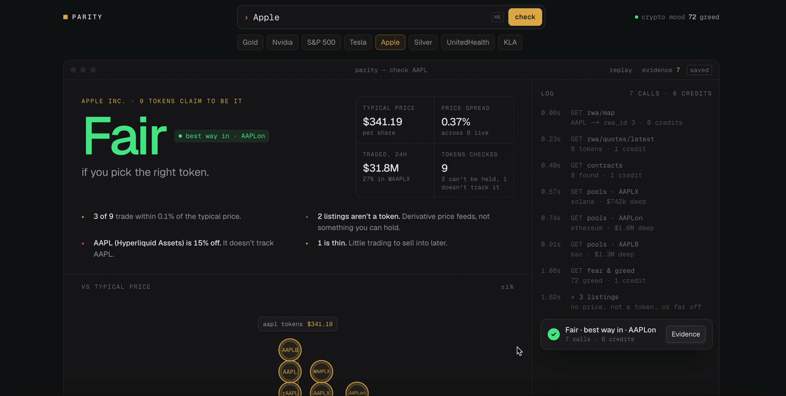

# Parity

**Is this token actually the thing, at a fair price, and can I sell it later?**

Type a ticker like `GOLD` or `NVDA`. Parity finds every token that claims to be that asset, puts them on one price scale, checks whether each one trades enough to sell later, and gives one verdict in plain English: **Fair**, **Rich**, **Thin** or **Ghost**. The evidence behind each verdict is one click away.

Parity is built for a **crypto-native retail buyer** who is about to buy a tokenised real-world asset on-chain. It isn't a terminal for fund desks.

Built for **Build with CMC** (DoraHacks), Real World Assets track, on the CoinMarketCap API.

> **Live:** **[parity-gray-one.vercel.app](https://parity-gray-one.vercel.app)**. Try [GOLD](https://parity-gray-one.vercel.app/?q=GOLD), [SILVER](https://parity-gray-one.vercel.app/?q=SILVER) or [KLAC](https://parity-gray-one.vercel.app/?q=KLAC). Verdicts are live, so they move with the market.





---

## The four verdicts, with a demo asset for each

| Verdict | Means | Try it | Why |
|---|---|---|---|
| **Fair** | Priced like the others, with a market to sell into | `/?q=GOLD` | 7 tokens. Two are quoted **per gram** and look 97% cheaper until converted. XAUt is the most traded. |
| **Rich** | Even the best token costs more than the typical price | `/?q=UNH` | When recorded (26 Sep), UNHon was the only UNH token with real trading, and it cost **+1.51%** (about $5.83 a share) over the typical price, the midpoint of the two tokens. That's about $11.65 more than UNHX. |
| **Thin** | The price is fine, but little trading to sell into later | `/?q=SILVER` | No token that tracks silver traded in the last day, so Parity recommends none: **"no easy way out"**. |
| **Ghost** | Nothing you can rely on: no price, not a real token, or tokens that disagree | `/?q=KLAC` | Its two holdable tokens are priced **about 10× apart** ($1,883.88 vs $188.26). Parity won't guess which one is right. |

These examples come from saved data (25–26 Sep), and they all work with no API key. The chips under the search box load them in one click. NVDA, SPY, TSLA, AAPL and MS are saved too.

**The live site uses live data, so verdicts move with the market.** On 29 Sep, GOLD, SILVER and KLAC still read Fair, Thin and Ghost live, but UNH had moved back to Fair. To see the Rich snapshot, run Parity locally with no key.

## What you see

- **Verdict:** a word in the verdict's colour, a one-line answer ("best way in · XAUt", "no easy way out") and four facts: typical price, price spread, amount traded in 24h, and tokens checked.
- **The instrument:** every token drops onto one price scale as a coin. Per-gram coins land in a red "looks 97% cheaper" zone, then grow and roll to their true price. Tokens that aren't real ("ghosts") fall through the line.
- **The log:** as the coins land, the log narrates each real API call and finding, then folds into a toast with the answer and an **Evidence** button.
- **Every token:** price, premium against the typical price, how easy it is to sell (the "exit"), and a verdict for each.
- **Best way in**, with the token's chain and contract so you can check it against the issuer's site.
- **What the data can't tell you:** the gaps we hit, shown instead of guessed around.
- **Evidence drawer:** every call, with its parameters, cost, timestamp and a trimmed copy of CoinMarketCap's response.
- **Share image:** every `?q=` link has its own verdict card, generated at `/api/og?q=`.

Not financial advice. Parity never says "buy": it says "best way in", or that there isn't one.

---

## Run it

Requires Node 20.9 or later (developed on Node 24).

```bash
git clone https://github.com/dan-build/parity.git
cd parity
npm install
npm run dev          # http://localhost:3000
```

### No-key quickstart (saved-data mode)

You don't need an API key. By default Parity runs in **saved-data mode**: it replays real CoinMarketCap responses recorded in `fixtures/` and spends no credits. Open:

- http://localhost:3000/?q=GOLD (Fair)
- http://localhost:3000/?q=UNH (Rich)
- http://localhost:3000/?q=SILVER (Thin)
- http://localhost:3000/?q=KLAC (Ghost)

Saved pages say **"saved data from [date]"**, and the title bar shows **saved**.

### Live mode

Create `.env.local`. It's git-ignored, and the key is only ever read on the server:

```bash
CMC_API_KEY=your-key
PARITY_DATA_MODE=live
```

A live check costs about 5–8 credits.

If live data isn't available, Parity **falls back to saved data automatically** and shows a one-line notice explaining why. That covers three cases:
- no key is set
- CoinMarketCap rate-limits the request (HTTP 429 or codes 1008–1011)
- CoinMarketCap fails

If the asset isn't saved, the page asks you to try again in a minute.

### Handy URLs

| URL | Does |
|---|---|
| `/?q=NVDA` | Server-rendered, shareable result |
| `/?q=GOLD&t=1400` | Freezes the reveal at 1.4s (for screenshots) |
| `/?q=GOLD&drawer` | Opens the Evidence drawer |
| `/api/check?q=NVDA` | The raw JSON behind the page |
| `/api/og?q=UNH` | The 1200×630 share image |

### Scripts

| Command | What it does | Credits |
|---|---|---|
| `npm test` | 192 tests: verdict engine, copy, log, fallbacks, rate limits, the MCP server (in memory and over stdio), the registry, the golden set, and checks that `METHOD.md` matches the code. All run against saved responses. | 0 |
| `npm run snapshot -- --kind auto` | Appends a private history snapshot of the watched assets (`scripts/watchlist.json`) to the git-ignored `history/` folder. Never published (see Licensing below). | 9 (prices) to ~60 (full) |
| `npm run registry:seed` | Adds registry entries for the watched assets from saved data (never overwrites) | 0 |
| `npm run eval` | The verdict scorecard: 9 golden cases covering all four verdicts, plus a diff against the saved baseline. Fails if verdicts change without a method version bump. CI runs it on every push. | 0 |
| `npm run mcp` | Starts the MCP server over stdio (see below) | 0 saved, 5–8 per live check |
| `npm run probe` | Runs the real engine for the six core assets through a recorder. Saves every response to `fixtures/` and probes the extra endpoints. | ~35 |
| `npm run probe -- UNH MS` | Records just those assets, engine calls only. Logs to `fixtures/_probe-UNH-MS.json`. | ~3–4 each |
| `npm run scan -- --budget 60` | Screens assets for RICH/GHOST candidates: reads the saved asset list, pulls live quotes and runs the real `verdict()`. Saves nothing. | 1 per asset |

`probe` and `scan` read `CMC_API_KEY` from `.env.local`. They space out calls to stay under 50 requests a minute, and print the day's credits before and after.

### Use it from an AI agent (MCP)

Parity is also an [MCP](https://modelcontextprotocol.io) server with one read-only tool, **`check_rwa(query)`**. It runs the same engine as the site and returns structured JSON:
- the verdict and the one-line answer
- the reasons
- the best way in, with its chain and contract (or `null` when nothing is recommended)
- every token, with price, premium, exit and verdict
- what the data can't tell you
- a share link

For Claude Code:

```bash
claude mcp add parity -- /path/to/parity/node_modules/.bin/tsx /path/to/parity/scripts/mcp.ts
```

For Claude Desktop or Cursor (`mcpServers` in the client's config):

```json
{
  "mcpServers": {
    "parity": {
      "command": "/path/to/parity/node_modules/.bin/tsx",
      "args": ["/path/to/parity/scripts/mcp.ts"]
    }
  }
}
```

It uses saved data by default, with no key and no credits. With `CMC_API_KEY` and `PARITY_DATA_MODE=live` in `.env.local`, it uses live data, with the same automatic fallback as the site. Then ask things like *"Is tokenised gold fairly priced right now? Which token should I look at?"*

### Licensing

Parity uses CoinMarketCap data inside its own product, with attribution, as CMC's API terms
allow. It doesn't redistribute that data: there's no public data API or hosted data endpoint,
and history snapshots stay private. The MCP server is self-hosted: each user runs it with their
own CoinMarketCap key.

---

## CoinMarketCap endpoints

**Used by the app:**

| Endpoint | Credits | Why |
|---|---|---|
| `GET /v5/real-world-assets/map?symbol=` | 0 | Resolves a ticker to an `rwa_id` in one request. Everything is keyed by ID, never by symbol. |
| `GET /v5/real-world-assets/map` (paged) | 0 | The full asset list, for name searches ("nvidia") and not-found suggestions. Cached for an hour. |
| `GET /v5/real-world-assets/quotes/latest` | 1 | Every token for the asset: issuer, price, market cap and 24h volume, plus the average tokenised price and TradFi venues |
| `GET /v2/cryptocurrency/info` | 1 | Turns each token's `crypto_id` into its chain and contract address (the RWA endpoints don't give them) |
| `GET /v2/tools/price-conversion` | 1 | **Metals only:** CMC's gold/silver spot price at the moment of the token quotes (`time` = the quotes' `last_updated`), so premiums compare tokens with the real metal, like-for-like. Metal IDs come from `/v1/fiat/map?include_metals=true`. |
| `GET /v1/dex/token/pools` | 1 per token | On-chain pool depth and volume on Ethereum, Solana and BSC, for the "can I sell it later?" score |
| `GET /v3/fear-and-greed/latest` | 1 | The "crypto mood" in the header, shown for context only |

**Probed but not used by the engine:**
- `/v1/key/info`: plan and credits used, for the scripts.
- `/v5/real-world-assets/info`, `issuers/list` and `issuers`: nothing the verdict needs.
- The three `/v5/derivatives/liquidations/*` endpoints: market-wide crypto only, nothing specific to RWAs.
- `/v5/real-world-assets/market-pairs/list`: **403** on our plan (see below).

---

## What the API made possible

- **One asset, every token.** `quotes/latest` puts every token for an asset into one response, from Paxos, Tether, Ondo, Backed, Robinhood and others, each with an issuer, price and volume. That's the core of Parity. Without it you'd have to find each issuer's token yourself.
- **Real identity, not symbols.** Keying by `rwa_id` and `crypto_id` lets Parity tell apart two different tokens both called `NVDA` (Robinhood's, and a derivative feed).
- **An exit check without market pairs.** Combining 24h volume, contract lookups and DEX pool depth gives a sell-later score, even with the market-pairs endpoint blocked.
- **Free resolution.** The RWA map costs 0 credits, so typing and searching never spends anything.
- **Evidence you can check.** Every response carries `credit_count` and a status. Parity logs each call and shows it in the Evidence drawer, so every claim traces back to a real response.

## Where the API got in the way

The full log is in [`FRICTION.md`](FRICTION.md). The highlights:

1. **Market pairs is blocked on the Startup tier (403, code 1006).** That's the endpoint that says where a token trades. We rebuilt "can I sell it later?" from volume, DEX depth and TradFi venues, and list the gap in the UI.
2. **No units.** Two gold tokens are quoted per gram and the rest per troy ounce, with nothing in the response saying which. Compared naively they look 97% cheaper. We infer the unit from the price the other tokens agree on, convert, and show the conversion.
3. **Tokens 10× apart, with no ratio field (new).** KLAC's two holdable tokens are $1,883.88 and $188.26. It's probably a share ratio, but the API doesn't say, so Parity refuses to call either one the real price.
4. **Missing names (new).** One SILVER token has a `null` symbol *and* name, and `/v2/cryptocurrency/info` rejects its ID. Parity shows "Unnamed listing", never a raw ID or "null".
5. **No chain or contract on RWA tokens.** Every on-chain check needs an extra `/v2/cryptocurrency/info` call first.
6. **Chain names differ between endpoints.** The info endpoint says `bnb`, but DEX pools needs `bsc`. The wrong name returns a misleading **500 "system is busy"**, not a 400, so it looks like an outage.
7. **The DEX pools docs don't match the response.** The docs describe a bare array, but the response is `{data, status}`. Numbers come back as 18-decimal strings, and `liqUsd` is missing on about half of NVDA's pool rows.
8. **One bad ID fails a whole batch.** A single ID `/v2/cryptocurrency/info` rejects fails the entire call. The fix is `skip_invalid=true`.
9. **The map is paged, with `limit` capped at about 200.** Fetching it naively for a name search once hit the 50 requests/min limit. We now try the one-request `?symbol=` lookup first and cache the rest.
10. **`error_code` is sometimes a string (`"1006"`) and sometimes a number (`400`).**
11. **The best-ranked token can have zero volume (new).** For SILVER, the token the ranking favours traded $0 in 24h. Parity recommends nothing ("no easy way out") rather than point anyone at a token they can't sell.

---

## How it's built

- **Next.js (App Router), TypeScript**, deployed on Vercel. All CoinMarketCap calls happen server-side. `CMC_API_KEY` never reaches the browser.
- `lib/cmc.ts`: typed client with one function per endpoint and a 60-second cache. It records every call as evidence.
- `lib/check.ts` → `lib/verdict.ts`: fetch, then a **pure, unit-tested** verdict engine that handles units, collisions, ghosts and exit scores.
- `lib/present.ts`: turns a result into copy and numbers. `lib/log.ts`: the narrating log, built only from real evidence.
- `components/desk/`: the page. `components/reveal/`: one animation clock, with every timing in `lib/reveal/timings.ts`.
- `app/api/og/route.tsx`: the share image (`next/og`). The colour-field backgrounds are pre-rendered per verdict by `scripts/og-backgrounds.mjs`.
- `fixtures/`: real recorded responses, used by saved-data mode, the fallback and the tests.

### Deploying

1. Import the repo into Vercel.
2. Set `CMC_API_KEY` (mark it **Sensitive**) and `PARITY_DATA_MODE=live` for **Production**. Preview deploys without the key fall back to saved data.
3. Optionally set `SITE_URL` if you use a custom domain; share-image URLs default to Vercel's production URL.

---

## The open registry

CoinMarketCap doesn't say what a token represents: an ounce, a gram, a whole share or a tenth
of one. Parity keeps that in [`registry/`](registry/), one JSON file per asset. Every fact
says where it came from, and unknown facts stay empty instead of guessed. The engine uses the
registry's units first. Tests check every recorded unit against real prices, so a wrong ratio
fails CI. Today 35 of 47 tokens have a unit. Help wanted: KLAC's share ratio, and redemption
terms and attestations for every token ([how to contribute](registry/README.md)).

## How verdicts are decided

Every rule and threshold is written down in [`METHOD.md`](METHOD.md), with a version number
and a changelog. Each result carries the method version that produced it. A test fails if the
document and the code disagree, and the eval fails if verdicts change without a new version.

## What's next

Parity's plan is to become the neutral, open trust check for tokenised assets. That means
real reference prices, an open registry of what each token represents (units, share ratios,
redemption terms) and alerts. Every step ships with its evaluations. See
[`ROADMAP.md`](ROADMAP.md).

---

Contributions are welcome: see [`CONTRIBUTING.md`](CONTRIBUTING.md). MIT licensed.

Data from [CoinMarketCap](https://coinmarketcap.com/api/). Not financial advice.
